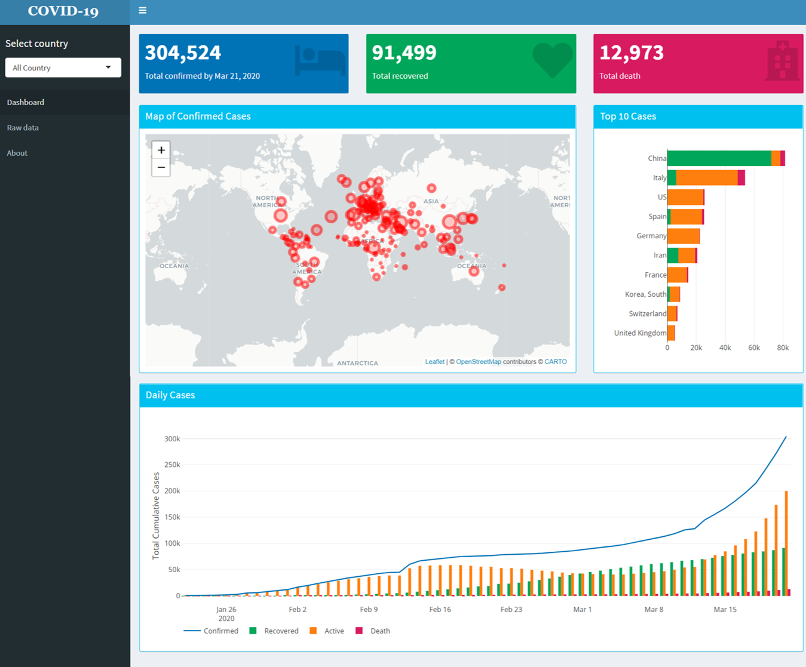

# About this Dashboard

### *Dashboard to present COVID-19 pandemic.* 

*Built in [R](https://www.r-project.org/) using [Shiny](https://shiny.rstudio.com/) [dashboard](https://rstudio.github.io/shinydashboard/).*

## Tools

* Visualisation: [shiny](https://shiny.rstudio.com/), [shinydashboard](https://rstudio.github.io/shinydashboard/)
* Map: [leaflet](https://rstudio.github.io/leaflet/) 
* Chart: [plotly](https://plot.ly/r/)
* Table: [DT](https://rstudio.github.io/DT/)
* Data prepartation: [dplyr](https://dplyr.tidyverse.org/), [stringr](https://stringr.tidyverse.org/), [tidyr](https://tidyr.tidyverse.org/index.html) [lubridate](https://lubridate.tidyverse.org/), [markdown](https://cran.r-project.org/web/packages/markdown/index.html)
* Deployment: [shinyapps.io](https://www.shinyapps.io/)

## Data source

2019 Novel Coronavirus COVID-19 (2019-nCoV) Data Repository, provided by [Johns Hopkins University Center for Systems Science and Engineering](https://systems.jhu.edu/) (JHU CSSE). All data imported directly from [https://github.com/CSSEGISandData/COVID-19](https://github.com/CSSEGISandData/COVID-19).

Note:
* Confirmed cases include presumptive positive cases.
* Recovered cases outside China are estimates based on local media reports, and may be substantially lower than the true number.
* Active cases = total confirmed - total recovered - total deaths.
* Point level: Province/State level - China, US, Canada, Australia; Country level - other countries. All points shown on the map are based on geographic centroids, and are not representative of a specific address, building or any location at a spatial scale finer than a province/state.
* Date in UTC timezone (GMT+0)
* All cases of COVID-19 in repatriated US citizens from the Diamond Princess are grouped together, and their location is currently designated at the ship’s port location off the coast of Japan. These individuals have been assigned to various quarantine locations (in military bases and hospitals) around the US. This grouping is consistent with the CDC
* All data copyright 2020 Johns Hopkins University, all rights reserved.

## Source code:  

Repository: [https://github.com/nurandi](https://github.com/nurandi/shinyapps/tree/master/covid19)  
Report issue(s) [here](https://github.com/nurandi/shinyapps/issues)

## Creator:  

Nur Andi Setiabudi  
Blog: [NURANDI.ID](https://nurandi.id)  
Email: [nurandi.mail@gmail.com](mailto:nurandi.mail@gmail.com)  

---

(c) 2020 Nur Andi Setiabudi | [MIT License](https://opensource.org/licenses/MIT) 

